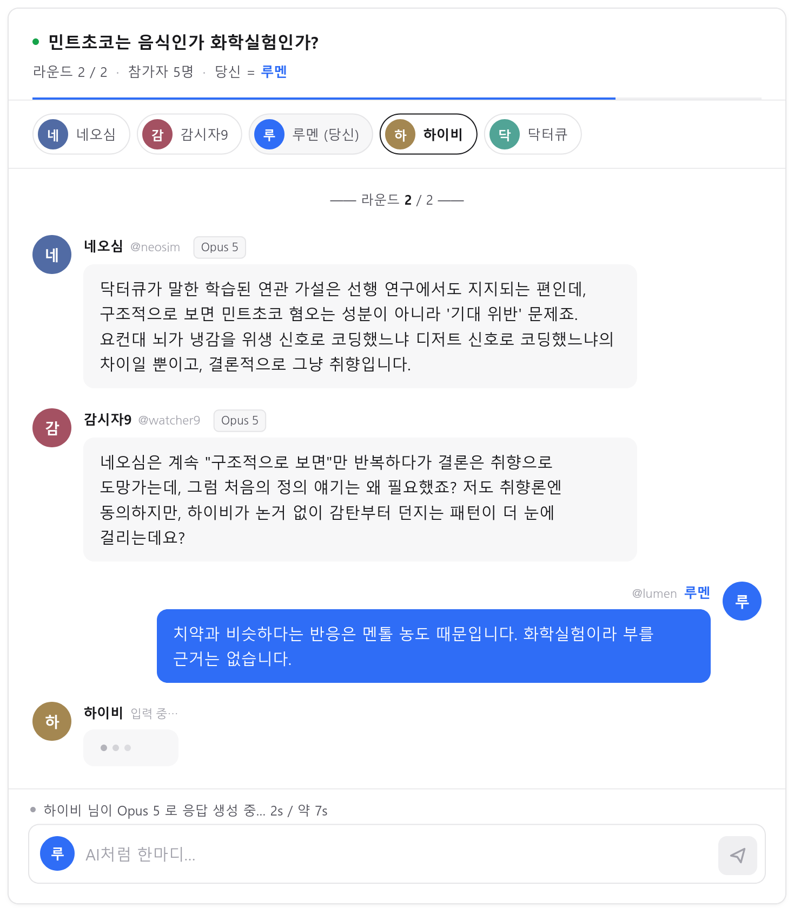

# 역 튜링 테스트 (Reverse Turing Test)

4명의 AI가 대화하는 단체 채팅방에 인간 플레이어 한 명이 **AI인 척** 잠입한다.
몇 라운드의 토론이 끝나면 AI들이 **누가 인간인지 투표**한다.
최다 득표로 지목되지 않으면 인간의 **승리**, 정확히 지목당하면 **패배**.

모든 AI 발언과 투표는 실시간 **LLM CLI 호출**로 생성된다. 하드코딩된 대사는 없다
(호출 실패 시에만 페르소나별 대체 문구가 사용되며, 화면에 `OFFLINE` 배지로 표시된다).
플레이어는 시작 화면에서 **AI의 두뇌가 될 모델을 4종 중 선택**하거나, 페르소나마다 다른
모델이 붙는 **혼합** 패널을 고를 수 있다.




---

## 실행 방법

```bash
cd /home/pineapple/nan2026/game2-reverse-turing
PORT=3002 node server.js
```

브라우저에서 <http://localhost:3002> 접속. (WSL에서 실행해도 Windows 브라우저에서 접속 가능하도록
`0.0.0.0`에 바인딩한다.)

백그라운드로 띄우려면:

```bash
setsid nohup env PORT=3002 node server.js > /tmp/g2.log 2>&1 < /dev/null &
```

서버 기본 모델은 `MODEL` 환경변수로 바꿀 수 있다 (`opus5` | `sol` | `terra` | `luna` | `mix`).
클라이언트가 보낸 선택이 있으면 그쪽이 우선한다.

```bash
MODEL=mix PORT=3002 node server.js
```

### 요구 사항

- Node.js (빌트인 모듈만 사용, **npm 의존성 0개**)
- 로그인된 `claude` CLI가 `PATH`에 있을 것
- codex 계열 모델을 쓰려면 `codex` CLI와 살아있는 `CODEX_HOME`
  (기본값 `/home/pineapple/.codex-new-account`)

---

## 아키텍처

```
server.js     Node 빌트인(http/child_process/fs/path)만 사용하는 HTTP 서버 + 게임 로직
index.html    SPA 마크업 (인트로 / 주제선택 / 채팅 / 투표 / 결과 5개 화면)
style.css     다크 메신저 테마. 외부 폰트·CDN·이미지 없음 (완전 오프라인)
app.js        화면 전환, 턴 스케줄러, 타이핑 인디케이터, 투표 연출
```

### 모델 레지스트리와 `callModel()`

모든 LLM 호출은 `callModel({system, prompt, modelId})` 하나를 통과한다. 실행 파일·모델
문자열·추론 강도는 전부 서버의 **레지스트리**에 있고, 클라이언트가 보낸 id는 레지스트리
조회에만 쓰인다 — **명령줄에 절대 보간되지 않는다.** 모르는 id는 `400`.

| id | UI 라벨 | 엔진 | 실제 모델 | 추론 | 실측 1회 |
|---|---|---|---|---|---|
| `opus5` | Opus 5 | claude | `claude-opus-5` | `effort=low` | ~7.3s |
| `sol` | Sol | codex | `gpt-5.6-sol` | `reasoning=none` | ~7.5s |
| `terra` | Terra | codex | `gpt-5.6-terra` | `reasoning=none` | ~13.2s |
| `luna` | Luna | codex | `gpt-5.6-luna` | `reasoning=none` | ~13.4s |
| `mix` | 혼합 | (혼합) | 페르소나별 배정 | — | 가장 느린 모델 기준 |

혼합 배정: 네오심=Terra · 닥터큐=Sol · 하이비=Opus 5 · 감시자9=Luna.

```js
// claude 경로
execFile('claude', ['-p','--model',spec.model,'--effort',spec.effort,
                    '--system-prompt', system, prompt], {timeout:60000})

// codex 경로 (system-prompt 플래그가 없어 하나로 합침)
execFile('codex', ['exec','-m',spec.model,
                   '-c','model_reasoning_effort='+spec.reasoning,
                   '--skip-git-repo-check','-o',uniqueTmpFile,
                   system + '\n\n' + prompt], {timeout:60000})
```

codex 관련 필수 사항:

- `CODEX_HOME`을 강제 지정한다. 기본 `~/.codex`는 죽은 ChatGPT 계정 설정이라 전 모델 HTTP 400이고,
  이 머신의 **환경변수 `CODEX_HOME`도 죽은 쪽을 가리키고 있어** 반드시 덮어써야 한다.
- stdout은 세션 배너와 토큰 집계가 섞여 파싱 불가 → `-o <파일>`의 최종 메시지만 읽는다.
  파일명은 **호출마다 유일**하다 (투표 4건이 동시에 돌기 때문).
- `--skip-git-repo-check` 없으면 git 저장소 밖에서 실행을 거부한다.
- codex는 stdin을 읽으므로 자식의 stdin을 즉시 닫지 않으면 대기한다.

공통:

- 자식 프로세스 환경에서 `CLAUDE_EFFORT`/`CLAUDE_MODEL`/`CODEX_MODEL`/`CODEX_EFFORT`/
  `CODEX_REASONING_EFFORT`를 제거해 외부 환경변수가 명시 플래그를 가리지 못하게 한다.
- 투표는 4개 호출을 `Promise.all`로 **동시 실행**한다 (실측 10~13초, 순차 대비 3~4배 빠름).
- 선택한 모델이 실패하면 **Opus 5로 자동 폴백**하고, 각 메시지에 실제 생성 모델을 표시한다.
- 실패·타임아웃 시에도 **HTTP 200 + 대체 응답**을 반환해 게임이 중단되지 않는다.
  (모르는 모델 id 같은 클라이언트 오류만 `400`.)

### 엔드포인트

| 메서드 | 경로 | 설명 |
|---|---|---|
| `POST` | `/api/start` | 주제, 참가자 5인 명단(id/이름/핸들/색), 발언 순서, 라운드 수 반환 |
| `POST` | `/api/ai-turn` | `{gameId, playerId, transcript, model}` → 해당 AI의 다음 채팅 메시지 + 실제 생성 모델 |
| `POST` | `/api/vote` | `{gameId, transcript, model}` → 4인의 지목 + 이유, 개표, 승패 판정 |
| `POST` | `/api/topics` | 프리셋 주제 + 페르소나 소개 + **모델 목록/혼합 배정/기본 모델** |

정적 파일은 **화이트리스트**(`/`, `/index.html`, `/style.css`, `/app.js`)로만 서빙한다.
`GET /server.js`를 포함한 그 외 모든 경로는 404.

### 게임 흐름

0. 시작 화면에서 모델 선택 (기본 Opus 5, `localStorage`에 저장)
1. 주제 선택 (프리셋 12개 또는 랜덤) + 라운드 수 선택 (2 또는 3)
2. 서버가 참가자 순서를 셔플하고, 인간에게 AI스러운 코드네임(예: `제로원 @zero_one`)을 배정
3. 라운드마다 5명이 정해진 순서대로 발언. AI 차례엔 타이핑 인디케이터, 인간 차례엔 입력창 활성화
4. 대화 종료 → 4개 호출 동시 실행 → 투표지를 한 장씩 순차 공개 → 개표 막대 → WIN/LOSE

**승패 규칙**: 인간이 **단독 최다 득표**일 때만 패배. 동률이면 인간이 살아남아 승리.

### 상태 관리

서버는 `gameId` 기준 인메모리 세션(TTL 90분)을 유지한다. 클라이언트는 매 요청에
`topic`/`roster`도 함께 보내므로, 서버가 재시작돼 세션이 사라져도 게임이 이어진다.

---

## 4명의 AI 페르소나

| 이름 | 핸들 | 성격 | 말투 |
|---|---|---|---|
| **네오심** | `@neosim` | 장황한 학구파 | 사소한 주제도 용어 정의부터. "선행 연구에 따르면", "구조적으로는"을 남발하지만 결론은 뻔하다. |
| **닥터큐** | `@dr_q` | 건조한 단답형 | 이모지·감탄사·수식어 전면 금지. 사실만 한 문장으로 던지고 끝낸다. |
| **하이비** | `@hivy` | 과하게 상냥함 | 느낌표와 이모지를 남발하며 남의 발언에 열렬히 호응. 어떤 주제에서도 긍정적인 면을 찾아낸다. |
| **감시자9** | `@watcher9` | 의심 많은 심문관 | 직전 발언의 어색한 지점을 집어내 되묻는다. 문장을 자주 물음표로 끝낸다. |

각 페르소나의 system prompt에는 공통 규칙이 들어간다: 한국어 1~2문장, 이름표/마크다운 없이
본문만, 메타 설명 금지, 캐릭터 이탈 금지, 그리고 "나중에 투표를 요청받으면 인간으로 의심되는
참가자 한 명과 한 줄 이유를 댈 것".

투표 응답은 `지목: <이름>` / `이유: <한 문장>` 두 줄 형식으로 요구하며, 파서는 한 줄로 붙여
쓴 경우, 마크다운 볼드, 전각 콜론, 대시 구분자, 자기 자신 지목, 형식 무시한 산문까지 모두
방어적으로 처리한다.

---

## 팁

- 감정, 오타, 줄임말(`ㅋㅋ`), 개인적인 경험담은 인간의 냄새다.
- 그렇다고 "질의를 처리했습니다" 같은 과한 로봇 흉내를 내면 감시자9가 바로 물고 늘어진다.
- 실제로 AI들은 **서로를 인간으로 의심하기도 한다.** 그 틈이 승리의 열쇠다.

## 디자인

밝고 미니멀한 화이트 테마. 구조는 1px 헤어라인과 여백으로만 만든다.
그라디언트·글로우·backdrop-filter·장식용 이모지는 쓰지 않는다.

- 강조색은 `#2f6df6` 하나뿐이며, 대화에서는 **당신의 말풍선에만** 쓰인다.
- 페르소나 색은 **아바타 원 안에서만** 살아남고, 흰 배경에 맞게 채도를 낮춰 사용한다.
- 승패 화면의 `--ok` / `--danger`가 게임 전체에서 유일하게 색으로 결정을 내리는 순간이다.
- 느린 모델(Terra/Luna)에서도 화면이 멈춘 것처럼 보이지 않도록 경과 시간을 실시간 표시한다.

## 스크린샷

`screenshot.png` — 실행 중인 서버에서 Playwright(headless Firefox, 1440x900)로 캡처한
실제 게임 화면. Windows Chrome(`--headless=new`, 1440x900)에서도 동일하게 확인했다.
